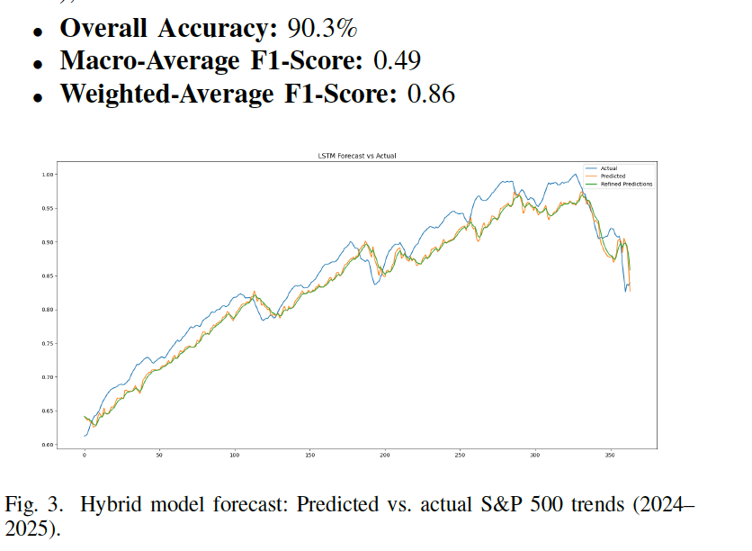

# Time-Series-Based-Pattern-Classification

Financial markets are complex, dynamic systems
marked by high volatility, nonlinearity, and rapid shifts driven by
internal dynamics and external events. These characteristics pose
significant challenges for accurate market trend prediction and
reliable trading strategy development, as traditional forecasting
models often struggle with noise, abrupt changes, and intricate
dependencies in financial time series data.
This study proposes a novel approach that integrates traditional
time series analysis, deep learning, wavelet-based features,
and attention mechanisms into a recurrent neural network (RNN)
to enhance market trend prediction and trading performance.
The model is trained in a simulated trading environment using
experience replay and an epsilon-greedy strategy, enabling the
agent to learn from historical data and adapt its decisionmaking
over time. Empirical evaluations demonstrate that the
proposed model achieves improved reward consistency and trend
classification accuracy, highlighting the efficacy of hybrid temporal
frequency representation learning for financial decisionmaking.
Furthermore, the model’s ability to capture multi-scale
temporal patterns and prioritize relevant features contributes to
its robustness across diverse market conditions. These findings
suggest potential applications in automated trading systems and
portfolio optimization.

Best Result:

